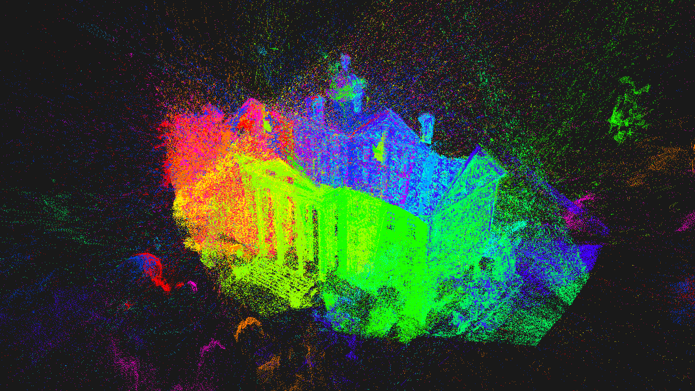
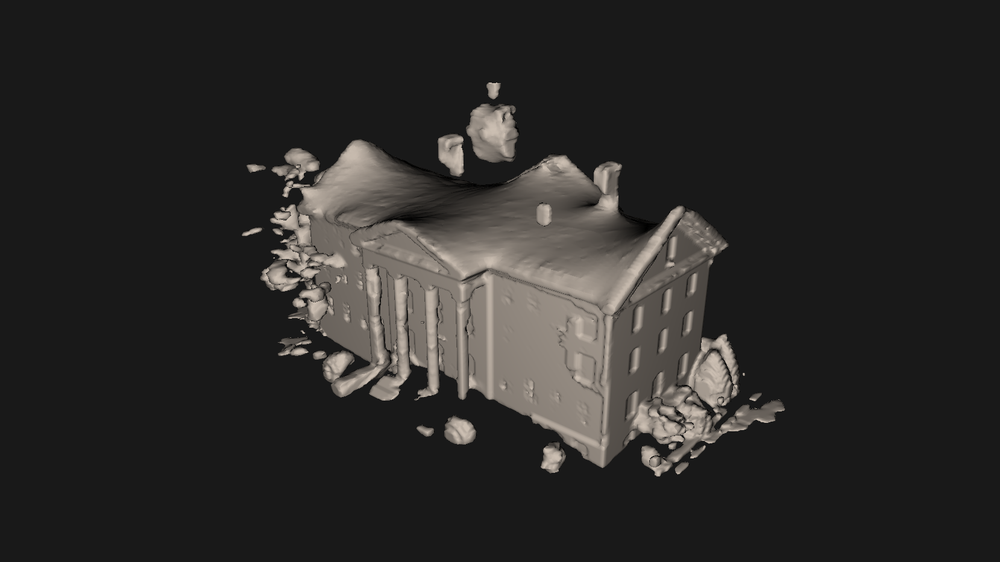

<link rel="stylesheet" href="https://cdn.knightlab.com/libs/juxtapose/latest/css/juxtapose.css">

    

        
        
    

    

        For the 3D Vision course during master studies at ETH, I've worked on the problem of depth map fusion, where a
        3D model is assembled given many coarse and noisy depth images of that model taken with a real camera.
    

    

        For our project, we've extended the baseline methods of depth map fusion described in 
        <i>Fast and High Quality Fusion of Depth Maps</i> by Zach et al. (2008) by including
        the surface normal estimation. These normal maps which correspond to the depth images were obtained
        using a deep learning-based classifier.
    

    
    
        The fusion method is implemented on the GPU using CUDA and is based on the Primal-Dual algorithm
        for energy minimization with total variation regularization.
    

    

        The final result gave us a slightly better mesh compared to the baseline methods. The project was realized in a team of three.
    

    

    <h3 class="content-section-title">References &amp; Further Reading</h3>
    <ol class="reference-list">
        <li>D. Vicini, N. Bartolovic and D. Keyes.<a href="https://drive.google.com/open?id=1ZM7SP8sd0_O0POszhlTB0HQgbYMsVria">
            <em>Depth map and normal direction fusion</em></a>. ETH Zurich, 3D Vision course. 2016.</li>
        <li>C. Zach. <a href="https://www.inf.ethz.ch/personal/pomarc/pubs/paper196.pdf"><em>Fast and high quality fusion of depth maps</em></a>. Proceedings of the international symposium on 3D data processing, visualization and transmission (3DPVT). Vol. 1. No. 2. 2008.</li>
    </ol>

