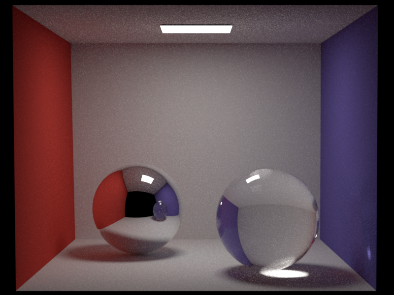
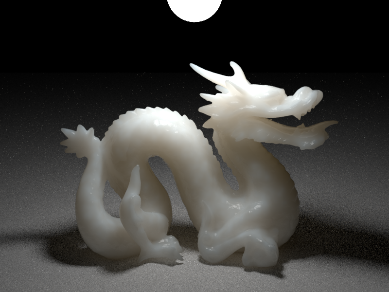
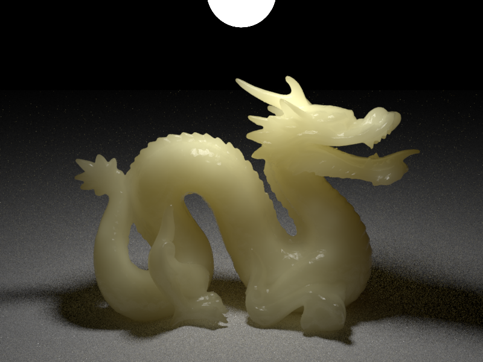
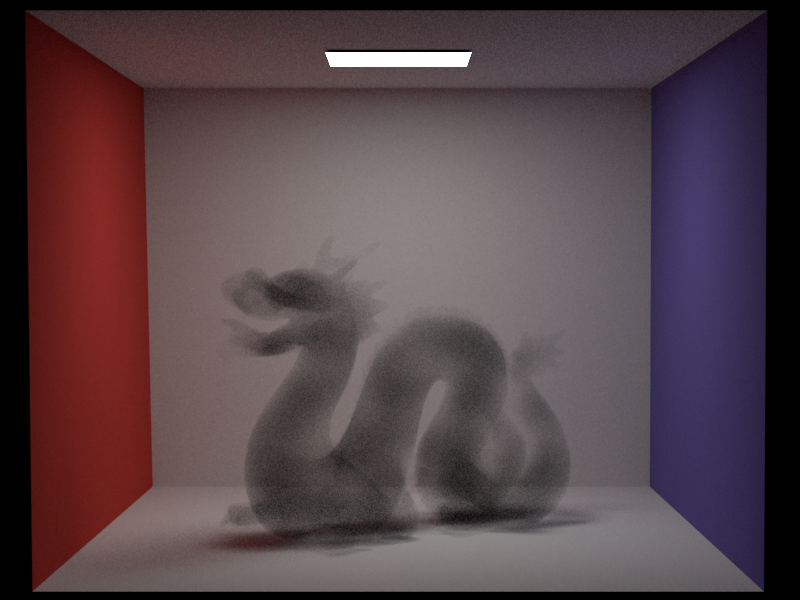
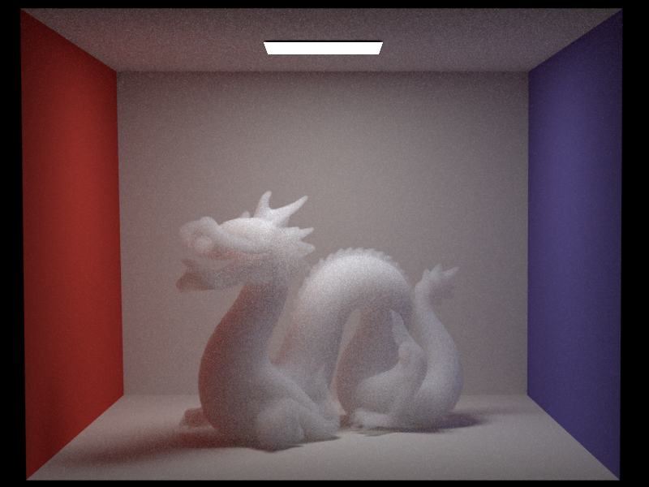
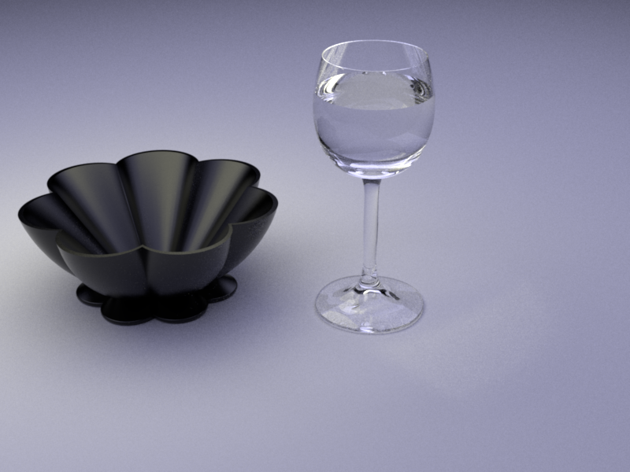
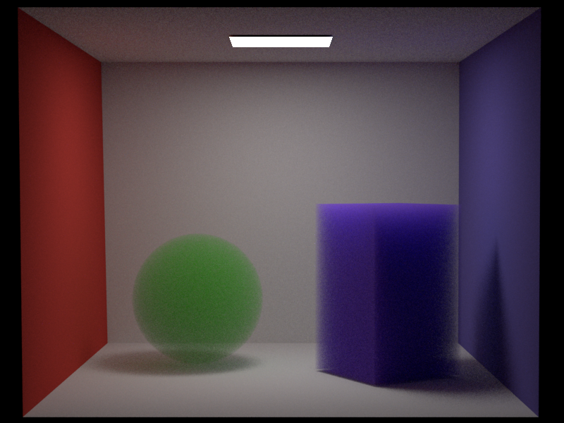
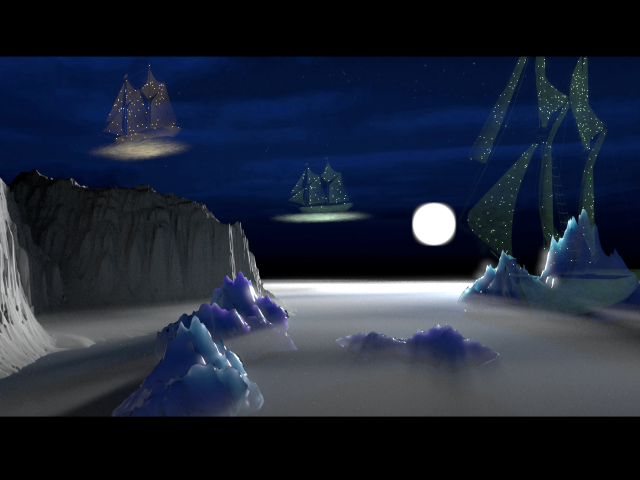

    

        <ol class="carousel-indicators">
            <li data-target="#mat-carousel" data-slide-to="0" class="active"></li>
            <li data-target="#mat-carousel" data-slide-to="1"></li>
            <li data-target="#mat-carousel" data-slide-to="2"></li>
            <li data-target="#mat-carousel" data-slide-to="3"></li>
            <li data-target="#mat-carousel" data-slide-to="4"></li>
            <li data-target="#mat-carousel" data-slide-to="5"></li>
            <li data-target="#mat-carousel" data-slide-to="6"></li>
            <li data-target="#mat-carousel" data-slide-to="7"></li>
            <li data-target="#mat-carousel" data-slide-to="8"></li>
            <li data-target="#mat-carousel" data-slide-to="9"></li>
        </ol>

        

            

                
                

                    <h4>A test for microfacet material model (Veach's PhD Thesis)</h4>
                

            

            

                
                

                    <h4>Cornell box</h4>
                

            

            

                
                

                    <h4>Photon mapping</h4>
                

            

            

                
                

                    <h4>Subsurface scattering (milk parameters)</h4>
                

            

            

                
                

                    <h4>Subsurface scattering (potato parameters)</h4>
                

            

            

                
                

                    <h4>Heterogeneous participating medium</h4>
                

            

            

                
                

                    <h4>Homogeneous participating medium</h4>
                

            

            

                
                

                    <h4>Microfacet bowl and glass scene</h4>
                

            

            

                
                

                    <h4>Cornell box with participating media</h4>
                

            

            

                
                

                    <h4>Final project image</h4>
                

            

        

        <a class="carousel-control-prev" href="#mat-carousel" role="button" data-slide="prev">
            
            Previous
        </a>
        <a class="carousel-control-next" href="#mat-carousel" role="button" data-slide="next">
            
            Next
        </a>
    

                    
    

        In the computer graphics course at ETH Zurich, our task was to gradually add features and extend the capabilities of a ray-tracing framework called Nori.
    

    

        Soms of the features that are showcased in the images and implemented throughout the course are listed below:
        <ul>
            <li>Volumetric path tracing with multiple importance sampling</li>
            <li>Photon mapping</li>
            <li>Smooth mirror and dielectric BRDF models</li>
            <li>Microfacet BRDF model with Beckmann distribution</li>
            <li>Subsurface scattering with dipole approximation</li>
            <li>Multiple different types of light sources</li>
        </ul>
        For the final project, we were tasked with producing an image that combines implemented features into a given theme.
    

